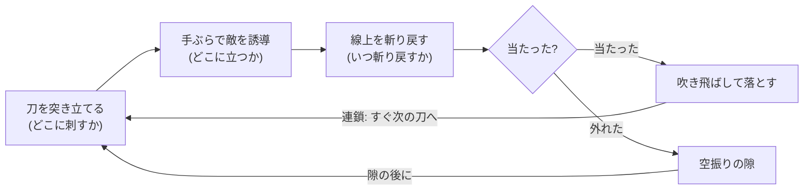

# 体験の核

攻撃手段は「刀の位置から、離した地点まで一直線に斬り戻す」ことだけ。判断の軸は「どこに刺すか」「どこに立つか」「いつ斬り戻すか」の3つに絞る。

```mermaid
flowchart LR
    A["刀を突き立てる<br/>(どこに刺すか)"] --> B["手ぶらで敵を誘導<br/>(どこに立つか)"]
    B --> C["線上を斬り戻す<br/>(いつ斬り戻すか)"]
    C --> D{当たった?}
    D -- 当たった --> E["吹き飛ばして落とす"]
    D -- 外れた --> F["空振りの隙"]
    E -- 連鎖: すぐ次の刀へ --> A
    F -- 隙の後に --> A
```

空振りの隙が一振りに重みを持たせ、当たったときの連鎖が爽快感を生む。斬り戻しは必ず離した地点へ戻るので逃げには使えず、崖っぷちに立つ緊張がそのまま遊びになる。
